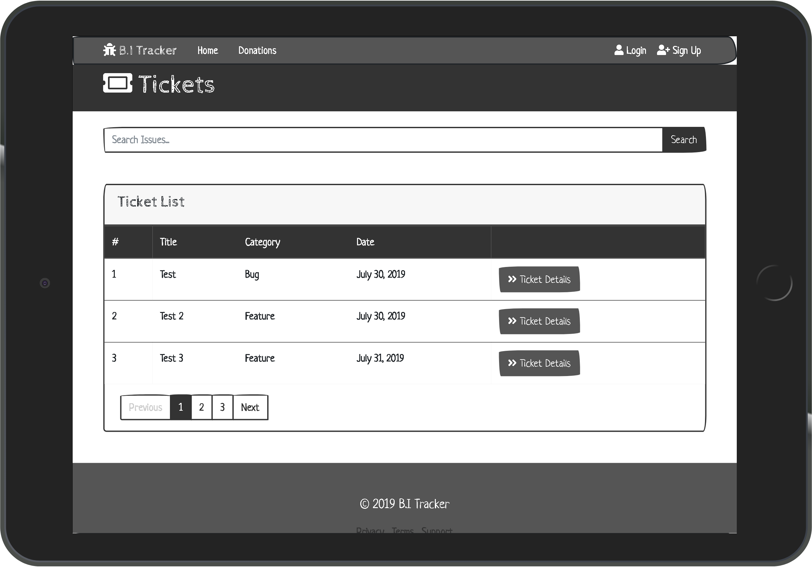

<h1 align="center">
<br>
  
  <br>
    <br>
  B.I Tracker 
  <br>
</h1>

<h4 align="center">An issue tracker web application that tracks bugs and feature requests.</h4>

This project is a fictional service, based on a real-world application, which offers a practical user-experience.

## Table of Contents

<!--ts-->

- [About](#About)

  - [Goal](#Goal)
  - [Functionality (User Stories)](#Functionality-User-Stories)
  - [Initiation](#Initiation)

- [UX](#UX)

  - [Layout Pro (Boundless Adaptability)](#Layout-Pro-Boundless-Adaptability)
  - [Layout Con (Moderate Speed and Execution)](#Layout-Con-Moderate-Speed-and-Execution)
  - [Tablet Display](#Tablet-Display)
  - [Mobile Display](#Mobile-Display)
  - [Additional Note](#Additional-Note)
  - [Colour Scheme](#Colour-Scheme)
  - [Font](#Font)
  - [Navigation](#Navigation)

- [Technologies](#Technologies)

  - [Languages Frameworks Tools](#Languages-Frameworks-Tools)
  - [Other-Resources](#Other-Resources)

- [Features](#Features)

  - [Existing Features](#Existing-Features)
  - [Features-Left-to-Implement](#Features-Left-to-Implement)

- [Testing](#Testing)

  - [Tools-and-Methods-Used-for-Testing](#Tools-and-Methods-Used-for-Testing)
  - [Additional-Points](#Additional-Points)
  - [Tested Sections 1](#Tested-Sections-1)
  - [Tested Sections 2](#Tested-Sections-2)

- [Deployment](#Deployment)

  - [How the project got deployed to Heroku](#How-the-project-got-deployed-to-Heroku)
  - [Cloning the repository](#Cloning-the-repository)
  - [How to access the live application](#How-to-access-the-live-application)
  - [How to run things locally](#How-to-run-things-locally)

- [Credits](#Credits)

  - [Content](#Content)
  - [Acknowledgements](#Acknowledgements)
    <!--te-->

## About

An **issue tracker** web application that tracks bugs and feature requests.


#### Goal

An Issue tracking web application system that allows the user's to record and follow the progress of every bug or feature-request identified until the problem gets resolved. Additionally, there is the inclusion of an option for user's to donate money to fund work on future bugs, and features requests.

The core focus of this project is on functional app logic created with **Python** while utilising the **Django** framework.

#### Functionality (User Stories)

- Ability to create tickets for: bugs, and feature-requests.
- View and edit existing tickets.
- Ability to send money donations.
- See what the site is about and its motivation before joining. 
- View documentation to how the site functions and any faq's. 
- Alternative to sign in/sign up with a nearby profile 
- See a rundown of as of recently made tickets on users landing page 
- Make/alter/update/erase my very own tickets for a bug/highlight demand. 
- Make/alter/update/erase my very own remarks for a bug/highlight demand. 
- Donate towards an element 
- View and perform activities on the site on a cell phone easily.

#### Initiation

Research to understand what apps of similar scope were already doing in terms of functionality which provided me with a list of what I consider to be feasible options for functionality implementations to acknowledge and consider pre-production.

[**To top**](#Table-of-Contents)

## UX

#### Layout Pro (Boundless Adaptability)

- Choosing a **multiple page application (MPA)** takes into consideration the choice to make new content and spot it on new pages. Multi-page applications can incorporate as much data as required, for this situation, numerous tickets, name enrolment page, donations page, account profile, with no page confinements. To say it necessarily, because there is a fair amount of content and features included on the application, I feel that an **MPA** is the best decision.

#### Layout Con (Moderate Speed and Execution)

- Being as this is a multi-page application, a server needs to reload most assets, for example, HTML, CSS, and **Python** with each interaction. When loading another page, the browser completely reloads page information and downloads all assets once more, even rehashed segments throughout all pages (for example the header/navigation) which influences Speed and Execution.

#### Tablet Display

- Please note, except a slight difference in page/scale responsiveness, desktop applies the same UI.


#### Mobile Display

- This image animation represents the standard UI across most modern mobile devices.


#### Template Style

Opted for a neutral style template with a pencil type design to project a more industrial look to the application whic was acheived via use of Bootstrap and [Bootswatch](https://bootswatch.com/ "Bootswatch Official Site")

#### Font

- Being as the website modelling is off a space theme, a pencil typeface choice was selected; thus, helping to emphasise a rough industrial theme to the displayed text content; a subjective opinion, of course.

#### Navigation

- Fixed navigation makes it easier for users to browse the website and increase retention: In some ways, it's a passive call to action; always visible, always available.

- Maintaining the logo visible increases brand value. Today there is an enormous number of apps, many with identical or similar features, so I feel that it’s vital to make a good impact on users and retain their interest, which can be all linked to a good brand image.

[**To top**](#Table-of-Contents)

## Technologies

#### Languages Frameworks Tools

- [HTML](https://www.w3.org/TR/html5/ "HTML5 Official Site")

  - Semantic markup language utilised as the shell of the site.

- [CSS](https://www.w3.org/Style/CSS/ "Cascading Style Sheets Official Site")

  - It is Cascading Style Sheets as the design of the site.

- [Python](www.python.org)

  - I have utilised to compose the game logic.

- [Django](https://www.djangoproject.com/)

  - Enables users to focus on developing components needed for their application.

- [Jinja2](http://jinja.pocoo.org/docs/2.10/)

  - Utilised to render HTML templates, imparting between front-end and back-end.

- [jQuery](http://jquery.com/ "Cascading Style Sheets Official Site")

  - HTML document traversal and manipulation, event handling.

- [Bootstrap](https://getbootstrap.com/docs/4.1/getting-started/introduction/ "Bootstrap Official Site")

  - Utilised for developing the entire UI and consistent throughout

- [Google Fonts](https://fonts.google.com/ "Google Fonts Official Site")

  - Saira font applied across the entire website

- [Font Awesome](https://fontawesome.com/ "Fontawesome Official Site")

  - Source for all utilised icons

  #### Other Resources

- [w3schools](https://www.w3schools.com/)
- [Stack Overflow](https://stackoverflow.com/)
- [Slack](https://slack.com/)

[**To top**](#Table-of-Contents)


## Features

#### Existing Features

-	Clients can peruse the current tickets in the database. 

-	Clients can make their own tickets. 

-	Clients can alter or erase their current tickets. 

-	Clients can enroll, view and login to their record. 

-	Clients can upvote or make a bug ticket for nothing. 

-	Clients can view advance on tickets being taken a shot at. 

-	A superuser can do the majority of the above in addition to alter/erase clients on the client rundown page and elevate clients to staff individuals.

#### Special Feature 

Donations (via Stripe) 

- Used Stripe Checkout with publishable key to send a user's credit card information to Stripe. The Stripe API then sends back a unique token for the user, which is used alongside a secret key on the server to submit a charge.

#### Features Left to Implement

-  Ability to update user profile picture.
- Change the most recent action date on Profile to indicate past last action date 
- Show name of signed in client in the nav bar

## Testing

#### Tools and Methods Used for Testing

- HTML

  - [Freeformatter](https://www.freeformatter.com/)

  - [The W3C Markup Validation Service](https://validator.w3.org/)

- CSS

  - [The W3C Markup Validation Service](https://jigsaw.w3.org/css-validator)

- Python

  - [Python Formatter](https://pythoniter.appspot.com/)

  - Phones

  - Galaxy Note 3 (simulation and actual device)
  - Galaxy Note 9
  - Galaxy S5
  - Galaxy S9/S9+
  - iPhone 5/SE
  - iPhone 6/7/8 (simulated and real device)
  - iPhone 6/7/8 Plus
  - iPhone X
  - LG Optimus L70
  - Microsoft Lumia 550
  - Microsoft Lumia 950
  - Nexus 5X
  - Nexus 6P
  - Nokia 8110 4G
  - Pixel 2
  - Pixel 2 XL

- Tablets
  - iPad (simulation and actual device)
  - iPad Mini
  - iPad Pro (10.5-inch)
  - iPad Pro (12.9-inch) (simulated and real device)
  - Kindle Fire HDX
  - Nexus 10
  - Nexus 7

* Laptops

  - MacBook Pro (simulated and real device)
  - Asus UX 305 (simulation and actual device)

* Televisions
  - 1080p Full HD Television (simulated and real device)

- Website responsiveness was also tested by resizing the window with every addition of a new code sequence.

#### Tested Sections 1 HTML & CSS

- External links to third party websites and code authors GitHub repository.

- Checked button sizes so, they were responsive and large enough to be clicked.

- Ensured individual section headers resized and appeared well when viewed on various device screens and added opacity to the navigation bar to allow for more visibility of section header area on smaller devices.

- Spell checked all text content.

- HTML and CSS validation via [w3.org](https://www.w3.org/ "W3C Official Site").

- Checked margins and padding of the container (sections) to ensure the content within it did not look disproportionate on various screen sizes, individually smaller devices.

#### Tested Sections 2 Python

Manual testing was embraced for this application and acceptably passed. An example of the tests directed are as per the following:

- Tested route catches and hyperlinks all through the page.
- Tested the rationale of the application by looking at expected conduct against the database record information.
- Tested the responsiveness of the application on various programs and after that utilising multiple gadgets.

[**To top**](#Table-of-Contents)

## Deployment

#### How the project got deployed to Heroku

#

#### Cloning the repository

1. Open Git Bash
2. Change the present working directory to the area where you wish to place the cloned directory.
3. Clone the repository or use the link below.

```console
git clone https://github.com/YOURUSERNAME/YOURREPONAME
```

Deploy your changes, make some changes to the code you just cloned and deploy them to Heroku using Git.

#### How to access the live application

- #

#### How to run things locally

1.  

[**To top**](#Table-of-Contents)

## Credits

#### Content

- All written content is original.

#### Disclaimer

This project is for educational purposes only.

[**To top**](#Table-of-Contents)