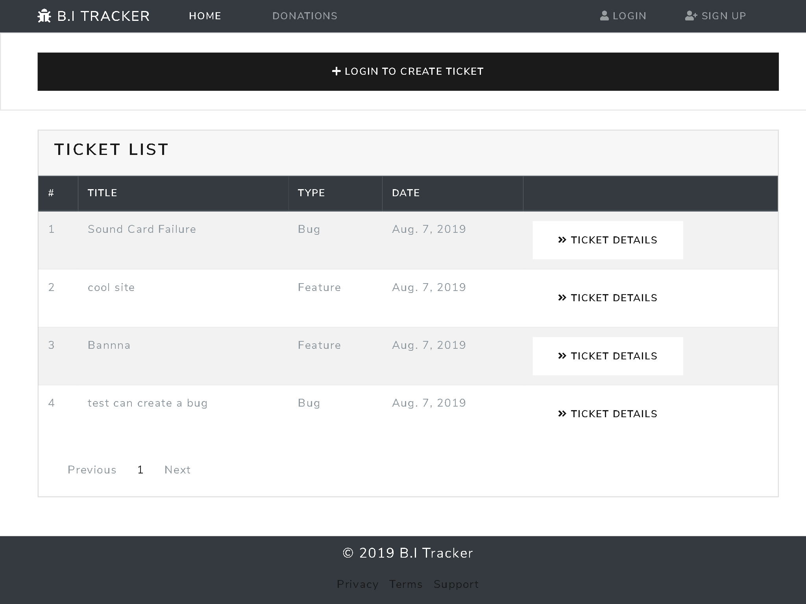
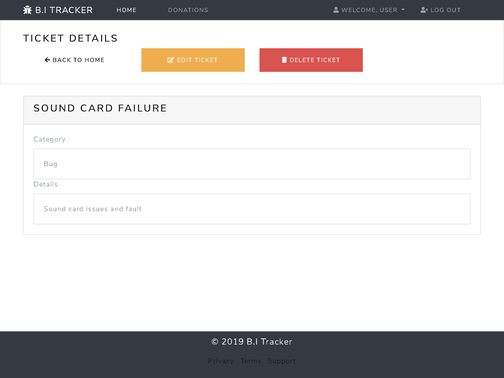
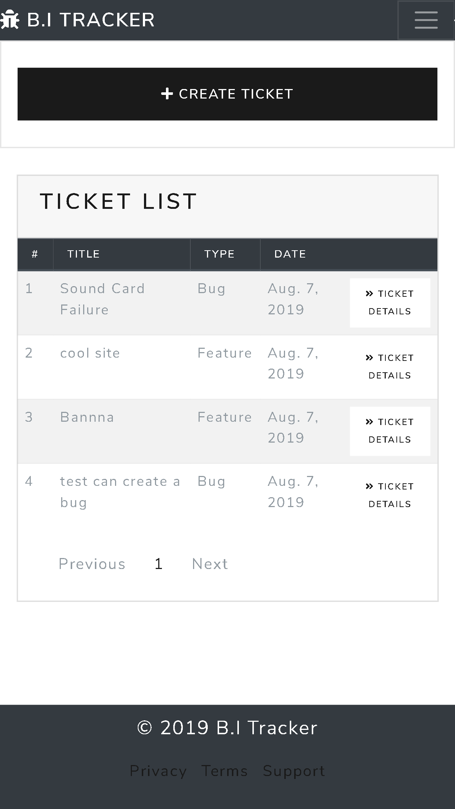
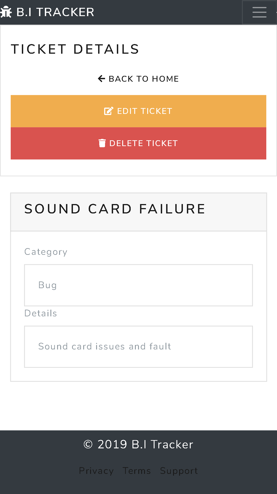

<h1 align="center">
<br>
  
  <br>
    <br>
  B.I Tracker 
  <br>
</h1>

<h4 align="center">An issue tracker web application that tracks bugs and feature requests.</h4>

This project is a fictional service, based on a real-world application, which offers a possible user-experience.

## Table of Contents

<!--ts-->

1. [About](#About)

    - [Goal](#Goal)
    - [Functionality](#Functionality-User-Stories)
    - [Initiation](#Initiation)

2. [UX](#UX)

    - [Layout Pro](#Layout-Pro-Boundless-Adaptability)
    - [Layout Con](#Layout-Con-Moderate-Speed-and-Execution)
    - [Tablet Display](#Tablet-Display)
    - [Mobile Display](#Mobile-Display)
    - [Colour Scheme](#Colour-Scheme)
    - [Navigation](#Navigation)

3. [Technologies](#Technologies)

    - [Languages, Libraries & Frameworks](#Languages-Libraries-&-Frameworks)

    - [Python Modules and Packages](#Python-Modules-and-Packages)

    - [Utilised Database](#Utilised-Database)

    - [Languages, Libraries & Frameworks](#Languages-Libraries-&-Frameworks)
    - [Other-Resources](#Other-Resources)

    - [Features](#Features)

    - [Existing Features](#Existing-Features)
    
    - [Features-Left-to-Implement](#Features-Left-to-Implement)

4. [Testing](#Testing)

    - [Tools-and-Methods-Used-for-Testing](#Tools-and-Methods-Used-for-Testing)
    - [Tested Sections 1 HTML & CSS](#Tested-Sections-1-HTML-&-CSS)
    - [Tested Sections 2 Python](#Tested-Sections-2-Python)
    - [Tested Sections 3 Forms](#Tested-Sections-3-Forms)
    - [Bugs (now resolved)](#Bugs-(now-resolved))

5. [Deployment](#Deployment)

    - [How the project got deployed to Heroku](#How-the-project-got-deployed-to-Heroku)
    - [Serving Static Files](#Serving-Static-Files)
    - [Database Setup](#Database-Setup)
    - [Cloning the repository](#Cloning-the-repository)
    - [How to access the live application](#How-to-access-the-live-application)
    - [How to run things locally](#How-to-run-things-locally)

6. [Credits](#Credits)

7. [Content](#Content)

8. [Acknowledgements](#Acknowledgements)
    <!--te-->

## About

An **issue tracker** web application that tracks bugs and feature requests.


#### Goal

An Issue tracking web application system that allows the user's to record and follow the progress of every bug or feature-request identified until the problem gets resolved. Additionally, there is the inclusion of an option for user's to donate money to fund work on future bugs and features requests.

The core focus of this project is on functional app logic created with **Python** while utilising the **Django** framework.

#### Functionality

- Ability to create tickets for bugs and feature requests.
- View and edit existing tickets.
- Ability to send monetary donations.
- See what the site is about and its motivation before joining.
- View documentation to how the site functions and any faq's.
- Alternative to sign in/sign up with a nearby profile
- See a rundown of as of recently made tickets on users landing page
- Make/alter/update/erase own-tickets for a bug/highlight demand.
- Make/alter/update/erase own-remarks for a bug/highlight demand.
- Donate towards an element
- View and perform activities on the site on a cell phone efficiently.

#### Initiation

Research to understand what apps of similar scope were already doing in terms of functionality. Results provided a list of what I consider to be feasible options for functionality implementations to acknowledge and consider pre-production.

[**To top**](#Table-of-Contents)

## UX

#### Layout Pro (Boundless Adaptability)

- Choosing a **multiple page application (MPA)** takes into consideration the choice to make new content and spot it on new pages. Multi-page apps can incorporate as much data as required, for this situation, many tickets, name enrolment page, donations page, account profile, with no page confinements. To say it necessarily, because there is a fair amount of content and features included on the application, I feel that an **MPA** is the best decision.

#### Layout Con (Moderate Speed and Execution)

- Being as this is a multi-page application, a server needs to reload most assets, for example, HTML, CSS, and **Python** with each interaction. When loading another page, the browser completely reloads page information and downloads all assets once more. Reloading happens even after rehashed segments throughout all pages (for example the header/navigation) which influences Speed and Execution.

#### Tablet Display

- Please note, except a slight difference in page/scale responsiveness, desktop applies the same UI.




#### Mobile Display

- This image represents the standard UI across most modern mobile devices.





#### Template Style

Opted for a neutral style template with a sketched type design to project a more industrial look to the application got achieved via the use of [Bootswatch](https://bootswatch.com "Bootswatch Official Site") framework for the theme and standard [Bootstrap](https://getbootstrap.com/ "Bootstrap Official Site") for the UI components base.

#### Navigation

- A navigation bar takes up space and a fixed one even more. Due to a lot of content on display in the form of tickets, etc., I deemed it not necessary to adjust the navigation as there was no real advantage.

#### Colour Scheme

- The generation of a bespoke colour was accomplished by blending RGB and Hex colours to those of a video background via the use of HTML & CSS.

  -  `#343a40` color description : Very dark grayish blue.

    - navigations
    - footer
    - table

  -  `#1a1a1a` color description : Very dark gray (mostly black).

    - button

  -  `#f7f7f7` color description : Very light gray (mostly white).

    - color

  -  `#f0ad4e` color description : Soft orange.

    - color

  -  `#d9534f` color description : Soft red.

    - color

  -  `#ffffff` color description : White.

    - color

A colour encyclopedia provided by [ColorHexa](https://www.colorhexa.com/ "ColorHexa Official Site") was used to generate matching colour palettes.

A placeholder image service provided by [Placeholder.com](https://placeholder.com/#How_To_Use_Our_Placeholders "Placeholder.com Official Site") was used to provide a list of colours for reference in the README file.

[**To top**](#Table-of-Contents)

## Technologies

#### Languages, Libraries & Frameworks

- [HTML](https://www.w3.org/TR/html5/ "HTML5 Official Site")
is a semantic markup language utilised as the shell of the site.

- [CSS](https://www.w3.org/Style/CSS/ "Cascading Style Sheets Official Site") represents Cascading Style Sheets used on the design of the site.

- [Python](www.python.org) was utilised to compose the game logic.

- [Django](https://www.djangoproject.com/) is a high-level Python Web framework that encourages rapid development and clean, pragmatic design.

- [PostgreSQL](https://www.postgresql.org/)  is a general-purpose object-relational database management system. It allows you to add custom functions developed using different programming languages, in this case, Python. 

- [jQuery](http://jquery.com/ "jQuery Official Site") for HTML document traversal and manipulation, event handling.

- [javascript](https://www.javascript.com/ "Javascript Official Site") is used to create responsive, interactive elements for web pages, enhancing the user experience.

- [Bootstrap](https://getbootstrap.com/ "Bootstrap Official Site") utilised for developing the entire UI.

- [Font Awesome](https://fontawesome.com/ "Fontawesome Official Site") is the source for all icons.

#### Python Modules and Packages

1. [Stripe](www.stripe.com/) is am online payment systems for making secure payments.

2. [Dj Database URL](https://pypi.org/project/dj-database-url/) enables interface with a database URL permit to utilise DATABASE_URL condition variable to arrange our Django application.

3. [Whitenoise](http://whitenoise.evans.io/en/stable/) permits to serve static records from Heroku without depending on different administrations.

4. [Gunicorn](https://gunicorn.org/) is a Python WSGI HTTP Server for UNIX.

5. [Bootswatch](https://bootswatch.com) used for styling generic Bootstrap components.

#### Utilised Database

Heroku Postgres database was utilised for the deployed app.

  #### Other Resources

- [w3schools](https://www.w3schools.com/)
- [Stack Overflow](https://stackoverflow.com/)
- [Slack](https://slack.com/)

[**To top**](#Table-of-Contents)

## Features

#### Existing Features

1. Login & Sign Up
2. Ticket List
3. View Ticket Details
4. Comment on own tickets
5. Comment on user profile
6. Edit/Delete tickets
7. Edit/Delete user profile
8. Open new tickets based on bugs or feature requests
9. Donate towards the application
10. Superusers/admins can gain access via the admin panel and perform, data amendments.

#### Features Left to Implement

1. Password Update
2. Username and password update
3. Presently it is just conceivable to add remarks identified with the ticket; it could likewise be intriguing to enable clients to answer legitimately to a particular remark 
4. Internal chat feature for users to interact with one another

## Testing

#### Tools and Methods Used for Testing

- HTML

  - [Freeformatter](https://www.freeformatter.com/)

  - [The W3C Markup Validation Service](https://validator.w3.org/)

- CSS

  - [The W3C Markup Validation Service](https://jigsaw.w3.org/css-validator)

- Python

  - [Python Formatter](https://pythoniter.appspot.com/)

- Phones

  - Galaxy Note 3 (simulation and actual device)
  - Galaxy Note 9
  - Galaxy S5
  - Galaxy S9/S9+
  - iPhone 5/SE
  - iPhone 6/7/8 (simulated and real device)
  - iPhone 6/7/8 Plus
  - iPhone X
  - LG Optimus L70
  - Microsoft Lumia 550
  - Microsoft Lumia 950
  - Nexus 5X
  - Nexus 6P
  - Nokia 8110 4G
  - Pixel 2
  - Pixel 2 XL

- Tablets
  - iPad (simulation and actual device)
  - iPad Mini
  - iPad Pro (10.5-inch)
  - iPad Pro (12.9-inch) (simulated and real device)
  - Kindle Fire HDX
  - Nexus 10
  - Nexus 7

* Laptops

  - MacBook Pro (simulated and real device)
  - Asus UX 305 (simulation and actual device)

* Televisions
  - 1080p Full HD Television (simulated and real device)

- Website responsiveness was also tested by resizing the window with every addition of a new code sequence.

#### Tested Sections 1 HTML & CSS

- External links to third party websites.

- Checked button sizes so, they were responsive and large enough to be clicked.

- Spell checked all text content.

- HTML and CSS validation via [w3.org](https://www.w3.org/ "W3C Official Site").

- Checked margins and padding of the container (sections) to ensure the content within it did not look disproportionate on various screen sizes, individually smaller devices.

#### Tested Sections 2 Python

Manual testing was embraced for this application and acceptably passed. An example of the tests directed are as per the following:

- Tested route catches and hyperlinks all through the page.

- Tested the rationale of the application by looking at expected conduct against the database record information.

- Tested the responsiveness of the application on various programs and after that utilising multiple gadgets.

#### Tested Sections 3 Forms

- Registration

  - Leave an obligatory field clear 

  - Input data using an invalid format

  - Apply username that as of now exists 

  - Apply non-coordinating passwords

- Login

  - Supplement wrong username/password

  - Supplement username that doesn't align with the password

  - Supplement password that doesn't align with the username

- User Profile

  - Clear and leave an obligatory field blank 

  - Input data using an invalid format

  - Apply and keep note data

- Create Ticket

  - Clear and leave an obligatory field blank 

  - Apply and save notes in the details field

  - Checked button size so, it was responsive and large enough to be clicked.

- Ticket Details

  - Delete specific and entire ticket data

  - Navigate to `edit ticket` function via a button 

  - Checked button size so, it was responsive and large enough to be clicked.

- Donations

- Supplement non-substantial card number 

- Supplement a past date for card expiry date 

- Supplement non-substantial CVC. 

> On occasion, the CVC instalments are acknowledged, notwithstanding when CVC is left clear or notwithstanding when a not substantial CVC is embedded. According to [Stripe Rules](https://stripe.com/docs/radar/rules) documentation.

[**To top**](#Table-of-Contents)

#### Bugs (now resolved)

A table from the Bootstrap framework caused a compatibility issue with Heroku due to its large size. Adding a custom media to condense the size; made the app more responsive on mobiles.

> See the **Acknowledgements** section for the credit given to my assistance in solving the problem.

## Deployment

#### How the project got deployed to Heroku

1. Make a `requirements.txt` file utilizing the terminal command 'pip freeze > `requirements.txt`

2. Make a `Procfile` with the terminal command `echo web: python app.py > Procfile`

> Example: web: gunicorn project.wsgi:application

3. `git add` and `git commit` the new prerequisites from the requirements.txt file and Procfile, then 'git push' the undertaking to GitHub. 

4. Go to the [Heroku](https://dashboard.heroku.com/) website.

5. Make another app on the [Heroku](https://dashboard.heroku.com/) website by tapping the "New" button on your dashboard. Name your app, followed by selecting Europe as your region. 

6. Select application

7. In the "Deployment Method" section, check to see if the application is connected already to GitHub. If not connected, then click the relevant button to link the Heroku website to the dashboard.

8. Affirm the connecting of the Heroku application to the right GitHub repository. 

9. In the application dashboard, click on "Settings" > "Reveal Config Vars". 

10. Set the accompanying config vars: 

#### Serving Static Files


1. Add `whitenoise` with pip install 

```console
pip install whitenoise
```

2. Add `whitenoise` to the `MIDDLEWARE` section of located in `base.py`

```console
MIDDLEWARE = [
    'whitenoise.middleware.WhiteNoiseMiddleware',
]
```

#### Database Setup

1. In Heroku, access the `resources tab` then in `addons` search for `Heroku Postgres`

2. In your application, configure `settings.py` as follows:

```console

DATABASES = {
    'default': {
        'ENGINE': 'django.db.backends.postgresql',
        'NAME': 'string',
        'USER': 'string',
        'PASSWORD': 'string',
        'HOST': 'manny.db.elephantsql.com',
        'PORT': '5432'
    }
}

``` 

3. In the Heroku application dashboard, click on "Settings" > "Reveal Config Vars". 

4. Set the accompanying config vars which should also include the `database_url`

5. Log in to `Heroku CLI`

```console
login Heroku
```

> Follow the remaining instructions which appear in your terminal.

6. From the console run the following command:

```console
heroku run python3 manage.py migrate --app online-cookbook-sipo
```

7. Create a `superuser`

```console
heroku python3 manage.py createsuperuser --app online-cookbook-sipo
```
- Any progressions made to modals when the `makemigrations` command is run locally require obligatory submission of your migration files and deployment of the newer versions. Afterwards, run `heroku run python3 manage.py migrate app online-cookbook-sipo` to create migrations in a development environment.

- Ordinarily, you would likewise need to introduce dj-database-url, a bundle that enables us to interface with a database url, and psycopg2 yet these bundles ought to be as of now introduced after the requirements.txt establishment

#### Cloning the repository

1. Open in terminal
2. Change the present working directory to the area where you wish to place the cloned directory.
3. Clone the repository or use the link below.

```console
git clone https://github.com/sipostudent/Milestone-Project-5.git
```

Deploy your changes, make some changes to the code you just cloned and deploy them to Heroku using Git.

#### How to access the live application

- A live demonstration is accessible by clicking [here](https://b-i-tracker.herokuapp.com/ "Live Demonstration: B.I Tracker").

#### How to run things locally


1. Download the project onto a PC and open with a source-code editor.

2. In the run.py file set the IP address and the PORT to the following:

```console
'IP', '127.0.0.1'
```

```console
'PORT', '8000'
```

3. Install all of the prerequisites shown in the requirements.txt file via opening a Command-line interface (CLI) and navigating to the project root or by opening an integrated terminal and entering the following command:

> Please Note: The CLI method for interacting with a computer may vary dependant upon the operating system in use.

```console
pip install -r requirements.txt
```

4. Initiate the app by entering the following command into a relevant terminal:

```console
python manage.py runserver
```

5. A message in your terminal will inform you that the project is now running with the following message:

```console
Running on http://127.0.0.1:8000/ (Press CTRL+C to quit)
```

6. To display the project, open the above URL (localhost:8000) 

[**To top**](#Table-of-Contents)

## Credits

#### Content

- Except for the app (online cookbook) recipes, all written content is original and created by the code author (Sipo Charles).

#### Acknowledgements

- I received inspiration for this project from visiting [b-i-tracker.herokuapp.com](https://b-i-tracker.herokuapp.com/), but mostly from my interaction with other students on Code Institute's Full Stack Software Development Programme.

- Special thanks to fellow Code Institute colleague [Anna Greaves](https://github.com/AJGreaves) for assistance with a bespoke media query which was utilised  to improve the responsiveness of the application.

#### Disclaimer

This project is for educational purposes only.

[**To top**](#Table-of-Contents)