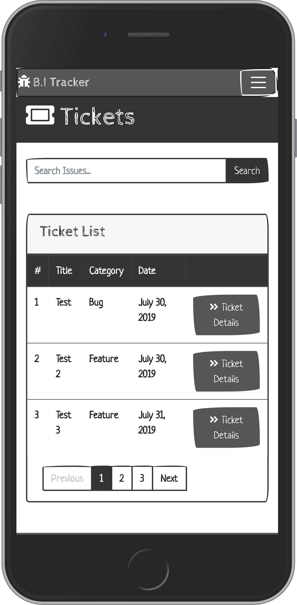

<h1 align="center">
 
  
   
     
  B.I Tracker 
   
</h1>

<h4 align="center">An issue tracker web application that tracks bugs and feature requests.</h4>

This project is a fictional service, based on a real-world application, which offers a practical user-experience.

## Table of Contents

<!--ts-->

1. [About](#About)

    - [Goal](#Goal)
    - [Functionality (User Stories)](#Functionality-User-Stories)
    - [Initiation](#Initiation)

2. [UX](#UX)

    - [Layout Pro](#Layout-Pro-Boundless-Adaptability)
    - [Layout Con](#Layout-Con-Moderate-Speed-and-Execution)
    - [Tablet Display](#Tablet-Display)
    - [Mobile Display](#Mobile-Display)
    - [Additional Note](#Additional-Note)
    - [Colour Scheme](#Colour-Scheme)
    - [Font](#Font)
    - [Navigation](#Navigation)
    - [Database Structure](#Database-Structure)

3. [Technologies](#Technologies)

    - [Languages Frameworks Tools](#Languages-Frameworks-Tools)
    - [Other-Resources](#Other-Resources)

    - [Features](#Features)

    - [Existing Features](#Existing-Features)
    - [Features-Left-to-Implement](#Features-Left-to-Implement)

4. [Testing](#Testing)

    - [Tools-and-Methods-Used-for-Testing](#Tools-and-Methods-Used-for-Testing)
    - [Tested Sections 1 HTML & CSS](#Tested-Sections-1-HTML-&-CSS)
    - [Tested Sections 2 Python](#Tested-Sections-2-Python)
    - [Unresolved Bugs](#Unresolved-Bugs)

5. [Deployment](#Deployment)

    - [How the project got deployed to Heroku](#How-the-project-got-deployed-to-Heroku)
    - [Cloning the repository](#Cloning-the-repository)
    - [How to access the live application](#How-to-access-the-live-application)
    - [How to run things locally](#How-to-run-things-locally)

6. [Credits](#Credits)

7. [Content](#Content)

8. [Acknowledgements](#Acknowledgements)
    <!--te-->

## About

An **issue tracker** web application that tracks bugs and feature requests.

#### Goal

An Issue tracking web application system that allows the user's to record and follow the progress of every bug or feature-request identified until the problem gets resolved. Additionally, there is the inclusion of an option for user's to donate money to fund work on future bugs, and features requests.

The core focus of this project is on functional app logic created with **Python** while utilising the **Django** framework.

#### Functionality

- Ability to create tickets for: bugs, and feature-requests.
- View and edit existing tickets.
- Ability to send money donations.
- See what the site is about and its motivation before joining. 
- View documentation to how the site functions and any faq's. 
- Alternative to sign in/sign up with a nearby profile 
- See a rundown of as of recently made tickets on users landing page 
- Make/alter/update/erase my very own tickets for a bug/highlight demand. 
- Make/alter/update/erase my very own remarks for a bug/highlight demand. 
- Donate towards an element 
- View and perform activities on the site on a cell phone easily.

#### Initiation

Research to understand what apps of similar scope were already doing in terms of functionality which provided me with a list of what I consider to be feasible options for functionality implementations to acknowledge and consider pre-production.

[**To top**](#Table-of-Contents)

## UX

#### Layout Pro (Boundless Adaptability)

- Choosing a **multiple page application (MPA)** takes into consideration the choice to make new content and spot it on new pages. Multi-page applications can incorporate as much data as required, for this situation, numerous tickets, name enrolment page, donations page, account profile, with no page confinements. To say it necessarily, because there is a fair amount of content and features included on the application, I feel that an **MPA** is the best decision.

#### Layout Con (Moderate Speed and Execution)

- Being as this is a multi-page application, a server needs to reload most assets, for example, HTML, CSS, and **Python** with each interaction. When loading another page, the browser completely reloads page information and downloads all assets once more, even rehashed segments throughout all pages (for example the header/navigation) which influences Speed and Execution.

#### Tablet Display

- Please note, except a slight difference in page/scale responsiveness, desktop applies the same UI.

#### Mobile Display

- This image represents the standard UI across most modern mobile devices.

#### Template Style

Opted for a neutral style template with a sketched type design to project a more industrial look to the application which was acheived via use of [Bootswatch](https://bootswatch.com "Bootswatch Official Site") framework for the theme and standard [Bootstrap](https://getbootstrap.com/ "Bootstrap Official Site") for the UI components base.

#### Navigation

- A navigation bar takes up space and a fixed one even more. That being the case, and that there is a lot of content to display in the form of tickets, etc., I deemed it not necessary to fix the navigation as there was no real advantage.

